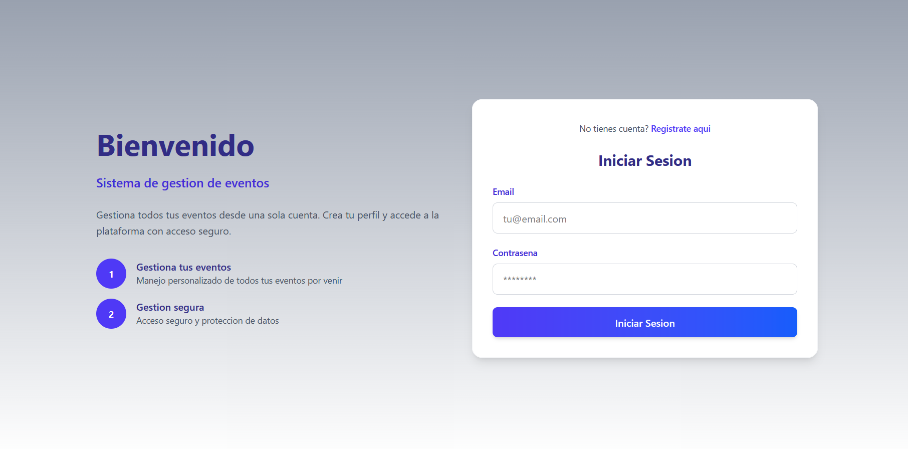
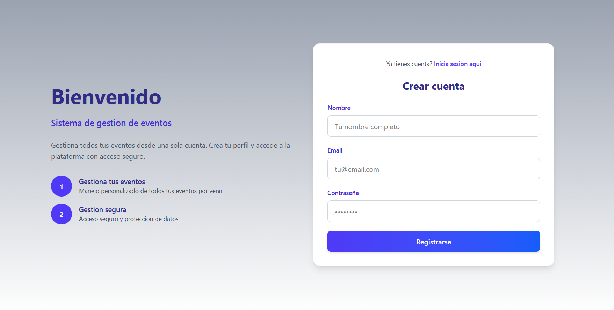
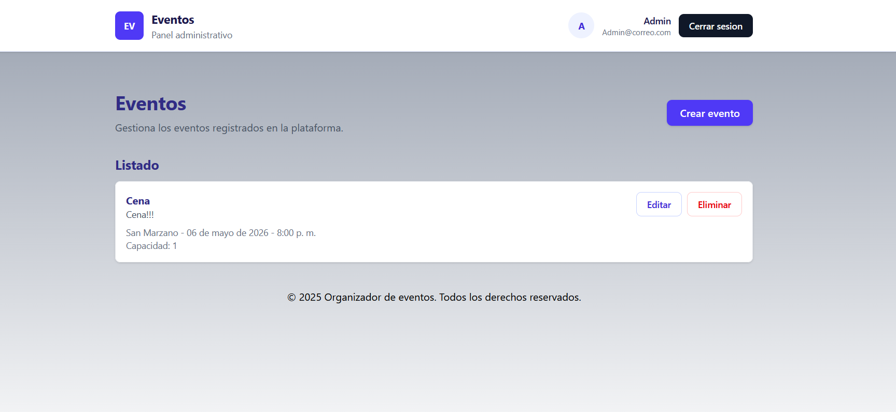
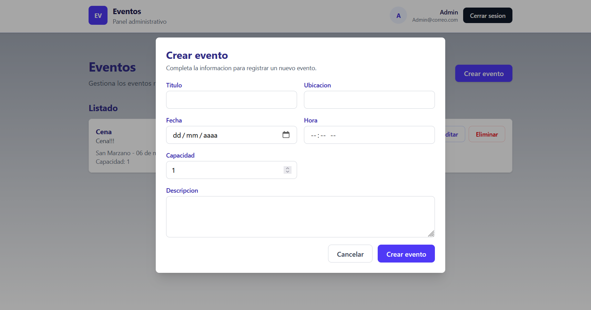
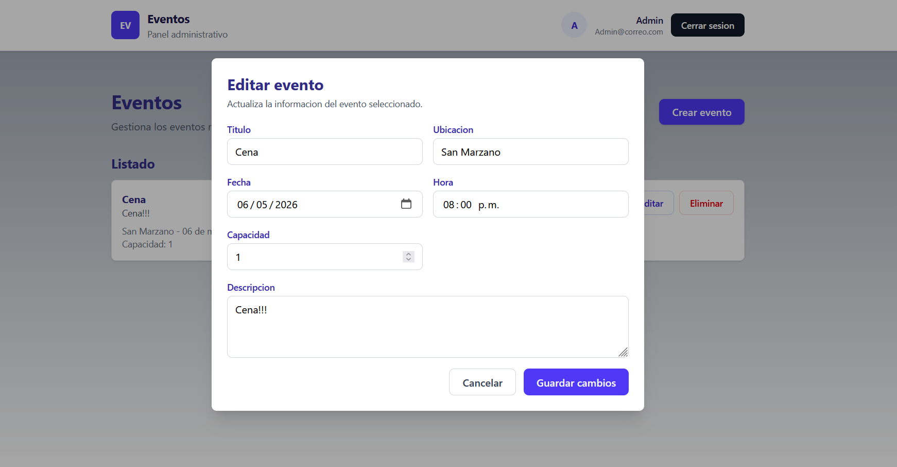

# 🎟️ Sistema de Gestión de Eventos - FullStack

## 📌 Descripción

Este proyecto es una aplicación **FullStack** desarrollada para la gestión de eventos, permitiendo a los usuarios registrarse, iniciar sesión y administrar sus propios eventos de manera segura.

El sistema implementa autenticación basada en **JWT (JSON Web Token)** y almacenamiento de datos en una base de datos **NoSQL (MongoDB Atlas)**.

---

## 🚀 Tecnologías utilizadas

### 🔧 Backend

- Java 17
- Spring Boot
- Spring Security
- MongoDB Atlas
- JWT (Json Web Token)
- BCrypt (encriptación de contraseñas)

### 🎨 Frontend

- React
- Vite
- JavaScript
- Fetch API

---

## 🧠 Arquitectura del Proyecto

El proyecto sigue una arquitectura por capas:

```
controller → service → repository → model → database
```

---

## 🔐 Autenticación

El sistema implementa autenticación basada en JWT:

- Registro de usuario
- Login con generación de token
- Protección de endpoints
- Autorización mediante encabezados HTTP

---

## 📂 Estructura del Proyecto

```
eventos-fullstack/
│
├── backend/
│   ├── controller/
│   ├── service/
│   ├── repository/
│   ├── model/
│   └── security/
│
├── frontend/
│   ├── src/
│   └── components/
│
└── README.md
```

---

## ⚙️ Configuración del Proyecto

### 🔧 Backend

1. Clonar el repositorio:

```bash
git clone https://github.com/TU_USUARIO/eventos-fullstack.git
```

2. Ir a la carpeta backend:

```bash
cd backend
```

3. Configurar variables sensibles. Crear archivo `application-local.properties`:

```properties
spring.data.mongodb.uri=TU_URI_MONGODB
jwt.secret=TU_SECRET
```

4. Ejecutar el proyecto:

```bash
mvn spring-boot:run
```

---

### 🎨 Frontend

1. Ir a la carpeta frontend:

```bash
cd frontend
```

2. Instalar dependencias:

```bash
npm install
```

3. Crear archivo `.env`:

```env
VITE_API_URL=http://localhost:8080
```

4. Ejecutar:

```bash
npm run dev
```

---

## 📡 Endpoints principales

### 🔐 Autenticación

| Método | Endpoint        | Descripción      |
|--------|-----------------|------------------|
| POST   | /auth/register  | Registro usuario |
| POST   | /auth/login     | Login + JWT      |

---

### 📅 Eventos

| Método | Endpoint      | Descripción               |
|--------|---------------|---------------------------|
| POST   | /events       | Crear evento              |
| GET    | /events       | Obtener eventos del user  |
| DELETE | /events/{id}  | Eliminar evento           |

---

## 🧪 Pruebas con API

Para consumir endpoints protegidos, incluir en el encabezado:

```
Authorization: Bearer TU_TOKEN
```

---

## 🖼️ Interfaz de Usuario

### 🔐 Login


### 📝 Registro


### 📅 Dashboard de Eventos


### ➕ Crear Evento


### ➕ Editar Evento


---

## 🔒 Seguridad

- Contraseñas encriptadas con BCrypt
- Autenticación con JWT
- Rutas protegidas en backend
- Variables sensibles no expuestas (`.env`, `.gitignore`)

---

## 🎯 Funcionalidades

- ✔ Registro de usuarios
- ✔ Inicio de sesión
- ✔ Generación de token JWT
- ✔ Protección de rutas
- ✔ CRUD de eventos
- ✔ Asociación de eventos por usuario

---

## 📈 Posibles mejoras

- Edición de eventos
- Roles (ADMIN / USER)
- Subida de imágenes
- Notificaciones
- Deploy en la nube

---

## 👨‍💻 Autor

**Jhon Amaya**

---

## 📄 Licencia

Este proyecto es de uso académico.
